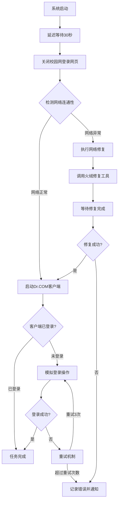

# 校园网自动登录工具架构设计

## 1. 需求分析

### 核心问题
1. 每次开机需要手动登录校园网
2. 开机时会弹出校园网登录网页，需要手动关闭
3. 有时忘记关闭VPN导致网络配置异常，需要火绒断网修复
4. 需要自动化整个过程

### 功能需求
- 开机自动运行
- 自动关闭校园网登录网页
- 检测网络连接状态
- 自动登录校园网客户端
- 网络异常时自动修复
- 修复后重新登录

## 2. 系统架构

### 组件设计
```
┌─────────────────────────────────────────────────────┐
│                 Auto Login Tool                      │
├─────────────────────────────────────────────────────┤
│ 1. 启动检测模块                                      │
│    - 开机自启动                                      │
│    - 延迟等待网络初始化                              │
│    - 检测Dr.COM客户端状态                            │
├─────────────────────────────────────────────────────┤
│ 2. 网页关闭模块                                      │
│    - 检测校园网登录网页窗口                          │
│    - 自动关闭网页浏览器                              │
│    - 处理多个浏览器实例                              │
├─────────────────────────────────────────────────────┤
│ 3. 网络状态检测模块                                  │
│    - Ping测试网络连通性                              │
│    - 检测VPN残留问题                                 │
│    - 判断是否需要修复                                │
├─────────────────────────────────────────────────────┤
│ 4. 修复模块                                          │
│    - 调用火绒断网修复工具                            │
│    - 等待修复完成                                    │
│    - 验证修复结果                                    │
├─────────────────────────────────────────────────────┤
│ 5. 登录模块                                          │
│    - 启动Dr.COM客户端                                │
│    - 模拟GUI操作输入账号密码                         │
│    - 点击登录按钮                                    │
│    - 验证登录成功                                    │
├─────────────────────────────────────────────────────┤
│ 6. 日志和错误处理模块                                │
│    - 记录操作日志                                    │
│    - 错误重试机制                                    │
│    - 通知用户                                        │
└─────────────────────────────────────────────────────┘
```

## 3. 流程图



## 4. 技术实现方案

### 4.1 编程语言选择
- **Python** (推荐): 跨平台，库丰富，适合自动化任务
- **AutoHotkey**: Windows GUI自动化专用
- **PowerShell**: Windows原生，无需安装

**推荐使用Python**，因为:
1. 有成熟的GUI自动化库 (pyautogui, pywinauto)
2. 可以调用命令行工具
3. 支持错误处理和日志记录
4. 易于维护和扩展

### 4.2 关键组件实现

#### 网络检测
```python
import subprocess
import platform

def check_network():
    """检测网络连通性"""
    param = '-n' if platform.system().lower() == 'windows' else '-c'
    command = ['ping', param, '3', '8.8.8.8']
    return subprocess.call(command) == 0
```

#### 火绒修复工具调用
```python
import subprocess
import time

def run_huorong_repair():
    """运行火绒断网修复工具"""
    huorong_path = r"D:\APP\huorongsecurity\Huorong\Sysdiag"
    # 需要确定具体可执行文件名
    exe_name = "hrfix.exe"  # 待确认
    cmd = [f"{huorong_path}\\{exe_name}", "/repair", "/silent"]
    subprocess.run(cmd, shell=True)
    time.sleep(30)  # 等待修复完成
```

#### Dr.COM客户端自动化
```python
import pyautogui
import time

def login_drcom(username, password):
    """模拟Dr.COM客户端登录"""
    # 启动客户端
    subprocess.run([r"C:\Users\luo\Desktop\APP\DrClient.exe"])
    time.sleep(5)
    
    # 定位窗口并输入账号密码
    pyautogui.write(username)
    pyautogui.press('tab')
    pyautogui.write(password)
    pyautogui.press('enter')
```

### 4.3 开机自启动
- Windows: 创建计划任务或注册表启动项
- 推荐使用计划任务，可以设置触发条件（系统启动后延迟运行）

## 5. 文件结构
```
auto_login_tool/
├── main.py              # 主程序入口
├── config.py            # 配置文件（账号密码等）
├── network_checker.py   # 网络检测模块
├── repair_tool.py       # 修复工具模块
├── login_automation.py  # 登录自动化模块
├── logger.py            # 日志模块
├── requirements.txt     # Python依赖
└── README.md            # 使用说明
```

## 6. 安全考虑
1. **密码存储**: 使用Windows Credential Manager或加密配置文件
2. **权限要求**: 需要管理员权限运行修复工具
3. **错误处理**: 避免无限循环，设置最大重试次数
4. **用户通知**: 重要操作通过系统通知告知用户

## 7. 测试策略
1. 单元测试: 各模块功能测试
2. 集成测试: 完整流程测试
3. 实际环境测试: 在不同网络状态下测试

## 8. 部署方案
1. 打包为exe文件 (使用PyInstaller)
2. 创建安装脚本
3. 配置计划任务
4. 提供卸载脚本